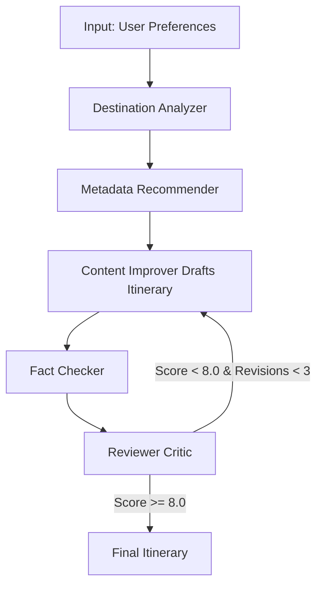

# Voyager AI 🌍✈️🤖

An Autonomous, Stateful, Multi-Agent Travel Planning Platform built with LongChain, LangGraph, and Groq.

Voyager AI goes beyond standard "chat wrapper" travel planners by simulating an entire agency of experts working together to research, build, critique, and finalize an itinerary.

## 🌟 Architecture Overview

This project implements an advanced **Plan-and-Solve with Actor-Critic** architecture using a stateful graph engine (LangGraph). The system consists of five distinct AI agents:

1. **Destination Analyzer:** Acts as the researcher. Gathers real-time intelligence about the destination using web search tools, identifying attractions, travel risks, and optimal visiting months.
2. **Metadata Recommender:** Acts as the categorizer. Determines the "vibe" and complexity of the trip based on user inputs.
3. **Content Improver (Actor):** Generates the actual day-by-day itinerary draft. It must adapt to restrictive feedback from the Critic.
4. **Fact Checker:** Extracts the top generated attractions and cross-references them against real-world data (via Tavily Search) to ensure they actually exist and make sense geographically.
5. **Reviewer Critic:** Evaluates the draft itinerary against the user's constraints (Budget, Duration, Style). If it fails to meet the threshold, it forces the Content Improver to rewrite the draft.



## 🛠️ Technology Stack

* **Core Engine:** Python 3.11+, LangChain, LangGraph
* **LLM Provider:** Groq (Llama 3 70B & 8B for ultra-fast, cheap inference necessary for multi-agent loops)
* **Tools:** Tavily (Optimized Agentic Web Search)
* **Frontend:** Streamlit 
* **Validation:** Pydantic (Strict schema enforcement for agent outputs)
* **CI/CD:** GitHub Actions (Automated pytest & flake8)

## 🗂️ Project Structure

```text
├── .github/workflows/ci.yml # Automated CI pipeline
├── src/
│   ├── agents/              # The 5 specialized LLM agents
│   ├── graph/               # LangGraph state machine and workflow definition
│   ├── tools/               # External tool integrations (Search, Markdown)
│   └── utils/               # Enterprise resilience (Circuit Breaker, Retry, Logger)
├── tests/                   # Pytest suite
└── app.py                   # Streamlit UI
```

## 🚀 Getting Started

### Prerequisites

You will need API keys for Groq and Tavily.
1. [Groq API Key](https://console.groq.com)
2. [Tavily API Key](https://tavily.com/)

### Installation

```bash
# Clone the repository
git clone https://github.com/yourusername/voyager-ai.git
cd voyager-ai

# Set up virtual environment
python -m venv venv
source venv/bin/activate # (Or .\venv\Scripts\activate on Windows)

# Install dependencies
pip install -r requirements.txt
```

### Configuration
Create a `.env` file in the root directory and add your keys:
```env
GROQ_API_KEY=your_groq_key
TAVILY_API_KEY=your_tavily_key
```

### Running the App
```bash
python -m streamlit run app.py
```

## 🧠 Why This Project Stands Out (For Recruiters/Hiring Managers)
* **Stateful Execution:** Uses a state graph instead of standard chain execution, allowing for infinite loops, internal memory, and human-in-the-loop capabilities.
* **Resilient Tooling:** Implements custom `retry` and `circuit_breaker` decorators to handle volatile external APIs gracefully.
* **Separation of Concerns:** Deeply decoupling the "Actor" (doing the work) from the "Critic" (evaluating the work) dramatically reduces LLM hallucination and improves adherence to complex user prompts.
